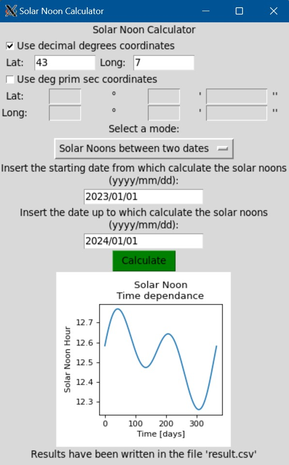

## Solar Noon Calculator
Python GUI program to calculate the solar noon in a given location, both at a given date or between two dates.

## Usage:
- Navigate inside the folder of the program
- Run the program by double clicking on `solarNoonCalculator.py` (or run it from the command line: `$ python3 solarNoonCalculator.py`): the GUI should appear
- Specify the coordinates of the location in which the solar noon is to be evaluated:
    - Use the decimal degrees checkbox and input boxes, or the deg/prime/sec ones, according to your preference;
- Specify the mode:
    - Today Solar Noon calculates the current date solar noon, and prints the result on the GUI;
    - Solar Noons between two dates:
        - Specify the start and end dates between whose the solar noons have to be evaluated;
        - The results are written in a `.csv` file named `result.csv`, and the time equation is displayed on the GUI;

## Dependencies:
The program is written for and needs Python3 to be executed; tested on Python3.6.9 64bit on Ubuntu in WSL.

The program needs the following python libraries:
- `pyEphem`: calculates high precision ephemerids;
- `datetime`: deals with date and time objects;
- `tkinter`: GUI library;
- `matplotlib`: plots library;

## Installation:

- Install python3:
    - On Unix shells: 
        `sudo apt-get update && sudo apt-get upgrade && sudo apt-get install python3`
    - On Windows:
        - Open the Microsoft Store;
        - Search python3;
        - Install the latest version (currently Python3.10)

- To install the python dependencies, once Python3 and Pip are installed, run the following command:
    - For UNIX shells:
        `$ python3 -m pip install pyephem tk datetime matplotlib`
    - For Windows CMD:
        - Open the command prompt (`WIN+R`, type `cmd.exe` and press enter)
        - Run the following command (paste it in the cmd and press enter):
        `pip install pyephem tk datetime matplotlib`

## Screenshots:

